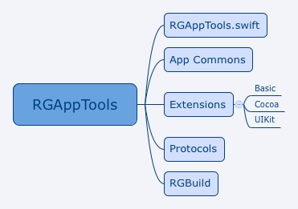

# RGAppTools

Swift 语言版本的 App 开发辅助工具集。

源码结构如下：

* `RGAppTools.swift` 为`Extension`中数据类型为类的数据规定了命名空间`rat`。
* `App Commons` 包含了应用开发中常用的单例对象、常用控件默认尺寸等内容。
* `Extensions` 中包含了对 Swift 标准库内的数据类型、Cocoa 框架(主要为 Foundation)、UIKit 中部分类／结构体的拓展。
* `Protocols` 中目前包含构建视图 Toplayout 的一些协议。
* `RGBuild` 包含一些其他工具。
